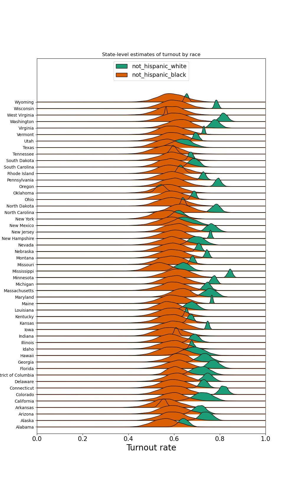

This week, I am interested in predicting the voting preference of each demographic group. But votes are confidential, so we don't have actual voting data of each demographic group. However, note that each county has a different demographic composition, and we *do* have the voting preference of each county. We can use this demographic variation across counties to extract the voting preference of each demographic group through a statistical technique called **ecological inference**. Gary King, a Government professor at Harvard, wrote extensively on [the technique](https://gking.harvard.edu/category/research-interests/methods/ecological-inference).

To show how this technique works, I will extract out voter turnout by racial group by looking at the demographic and voting preference variation across states. We can then compare our results with the estimates from the [Census Bureau](https://www.census.gov/topics/public-sector/voting.html). Here's what the Census Bureau tells us.

It seems like recent years we are seeing an upward trend of civic engagement! Another interesting feature in the plot above is that non-hispanic blacks had higher turnout rates than non-hispanic whites in 2008 and 2012, which is when Obama was running for elections. However, here is a quote from the [US Elections Project](https://www.electproject.org/election-data/voter-turnout-demographics).

> Surveys have error: both as a consequence from random sampling and from other issues, such as who responds to a survey and the truthfulness of their responses. Pollsters have long noted that poll respondents overstate their voting participation. A primary reason -- although not the only one -- is that people like to think of themselves in a favorable light within social norms, in this case presenting themselves as voters even if they did not vote.

In other words, we expect this surveyed turnout to be higher than the actual turnout. Another ground truth is the voter file, which is maintained by the states and records whether a voter has voted in any given previous elections. The voter file I have access to only have the voting record for the 2020 presidential election.

Seems like the voter file is not telling us much with its incomplete records. Also take note that some voters who voted in 2020 might have been removed from the current voter file if they are deceased.

Now let's try out ecological inference. First, we have the demographic variation across states.

Second, we have the turnout variation across states.

Using these two datasets, along with the total number of voters in each state, we can estimate the turnout for each racial group, by state, using ecological inference. Here are our results.

We can then compare our estimates for the turnout by racial group to other sources of turnout.

It turns out that the estimated turnout (71\%) for whites are spot on, with a tight 95\% credible interval hugging the surveyed turnout (73\%). For blacks, the surveyed turnout (66\5) is on the upper bound of the estimated turnout (59\%). For hispanics, the estimated turnout is 67\%, more than 52\% from the survey. The estimate for other vote share is spot on about 60\% surveyed vs 57\% estimated.

Here is a table concluding our findings.

| Racial Group   | Turnout Rate (Voter File)   | NA Rate (Voter File)   | Absent Rate (Voter File)   | Surveyed Turnout (Census Bureau)   | Estimated Turnout (Ecological Inference)   | Lower Bound (Ecological Inference)   | Upper Bound (Ecological Inference)   |
|:---------------|:----------------------------|:-----------------------|:---------------------------|:-----------------------------------|:-------------------------------------------|:-------------------------------------|:-------------------------------------|
| White          | 49%                         | 38%                    | 13%                        | 73%                                | 71%                                        | 69%                                  | 73%                                  |
| Black          | 36%                         | 49%                    | 15%                        | 66%                                | 59%                                        | 54%                                  | 66%                                  |
| Hispanic       | 39%                         | 56%                    | 5%                         | 52%                                | 67%                                        | 62%                                  | 73%                                  |
| Other          | 33%                         | 56%                    | 11%                        | 60%                                | 57%                                        | 50%                                  | 65%                                  |

Moving forward, it will be interesting to analyze the 2024 election to get the vote preference of each racial group. In the meantime, for forecasting, we can use a forecast of turnout for each racial group to get a more accurate estimate for the battleground states.
