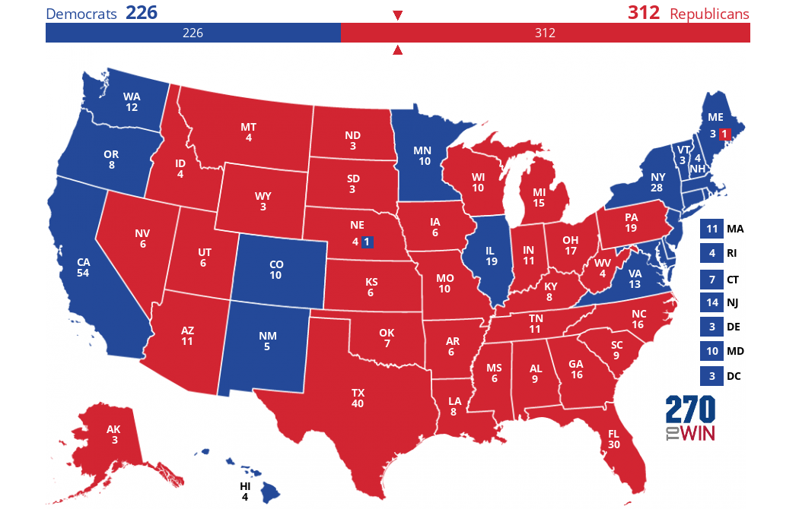

Informed by our analysis throughout the semester, we will build our final model to predict the winner of the 2024 US presidential election.

```{r setup, include=FALSE}
knitr::opts_chunk$set(echo = FALSE, warning = FALSE, message=FALSE)
set.seed(123)

library(ranger)
```


# Origins

Our model is inspired by the simple and powerful Abramowitz model below.

\[
\underbrace{\text{pv2p}}_{\text{incumbent party}} = \beta_0 + \beta_1 \cdot \underbrace{\text{G2GDP}}_{\text{Q2 GDP growth}} + \beta_2 \cdot \underbrace{\text{NETAPP}}_{\text{June Gallup job approval}} + \beta_3 \cdot \underbrace{\text{TERM1INC}}_{\text{sitting pres}}
\]

To compare it with our final model, which uses data limited to 2008 onward, let's find its performance on elections since 2008.

```{r}
library(dplyr)

popvote <- read.csv("../data/popvote_1948-2020.csv")

fred_econ <- read.csv("../data/fred_econ.csv")
fred_econ <- fred_econ |>
  filter(quarter==2, !is.na(GDP_growth_quarterly)) |>
  select(year, GDP_growth_quarterly) |>
  rename(q2_gdp_growth = GDP_growth_quarterly)

popvote <- popvote |>
  left_join(fred_econ)


popvote_incumbent_party <- popvote |>
  filter(incumbent_party == TRUE, !is.na(pv2p))
```


```{r}
# Load necessary libraries
library(caret)  # For leave-one-out cross-validation

# Random Forest model (set a seed for reproducibility)
set.seed(123)

selected <- popvote_incumbent_party |>
  filter(year>=2004)

# Step 1: Perform Leave-One-Out Cross-Validation for the linear model
lm_loo_errors <- sapply(1:nrow(selected), function(i) {
  # Fit the model excluding observation i
  lm_loo <- lm(pv2p ~ juneapp + q2_gdp_growth + incumbent, data = selected[-i, ])
  # Predict the excluded observation
  prediction <- predict(lm_loo, data = selected[i, ])
  # Calculate the squared error for the excluded observation
  (selected$pv2p[i] - prediction)^2
})

pred_errors <- sapply(1:nrow(selected), function(i) {
  # Fit the model excluding observation i
  lm_loo <- lm(pv2p ~ juneapp + q2_gdp_growth + incumbent, data = selected[-i, ])
  # Predict the excluded observation
  prediction <- predict(lm_loo, newdata = selected[i, ])
  # Calculate the squared error for the excluded observation
  abs(selected$pv2p[i] - prediction)
})

# Step 3: Calculate the Root Mean Squared Error (RMSE) for both models
lm_rmse <- round(sqrt(mean(lm_loo_errors)),2)
lm_mean_error <- round(mean(pred_errors),2)
# Step 4: Print the results
cat("Abramowitz LOO-CV RMSE:", lm_rmse, "\n")
cat("Abramowitz LOO-CV prediction error:", lm_mean_error, "%\n")
```


Instead of the popular vote, let's build upon the model to predict the 2024 winner of the electoral college.

We will use this metric to evaluate our model: leave-one-out root mean square error (LOO-RMSE) of competitive states.

# Modifications

## Moving from national to state-level

To predict the winner of the electoral college we need to predict the two-party vote share of each state. We will replace the Q2 GDP growth variable from national to state-level, and the June Gallup job approval to state-level presidential polls 20 weeks before the election.

```{r}
# Load necessary libraries
library(stringr)

state_gdp <- read.csv("../data/gdp_state_2005_2022.csv")

# Create the 'Year' and 'Quarter' columns
state_gdp <- state_gdp %>%
  mutate(
    Year = str_sub(Years, 1, 4),  # Extract the year
    Quarter = case_when(
      str_detect(Years, "01-01") ~ "Q1",
      str_detect(Years, "04-01") ~ "Q2",
      str_detect(Years, "07-01") ~ "Q3",
      str_detect(Years, "10-01") ~ "Q4"
    )
  ) |>
  select(-Years)

names(state_gdp) <- tolower(names(state_gdp))
```

```{r}
library(tidyr)

state_gdp <- state_gdp |>
  pivot_longer(cols=setdiff(names(state_gdp), c("year","quarter")),
               names_to="state",
               values_to="GDP")
```

```{r}
state_gdp <- state_gdp |>
  pivot_wider(names_from="quarter",
              values_from="GDP")
```

```{r}
state_gdp <- state_gdp %>%
  group_by(state) %>%  # Group by state
  arrange(year) %>%    # Arrange data by year within each state
  mutate(Q2_prev_year = lag(Q2, 1)) |>
  mutate(Q3_prev_year = lag(Q3, 1)) |>
  mutate(Q2_4_year = lag(Q2, 3)) |>
  mutate(Q3_4_year = lag(Q3, 3))

state_gdp$q2_gdp_growth <- (state_gdp$Q2 - state_gdp$Q2_prev_year)/state_gdp$Q2_prev_year*100

state_gdp$q3_gdp_growth <- (state_gdp$Q3 - state_gdp$Q3_prev_year)/state_gdp$Q3_prev_year*100

state_gdp$q2_gdp_growth_4y <- (state_gdp$Q2 - state_gdp$Q2_4_year)/state_gdp$Q2_4_year*100

state_gdp$q3_gdp_growth_4y <- (state_gdp$Q3 - state_gdp$Q3_4_year)/state_gdp$Q3_4_year*100
```

```{r}
election_years <- seq(1992, 2020, by=4)
state_gdp <- state_gdp |>
  filter(year %in% election_years)
```

```{r}
state_gdp$state <- gsub("\\.", " ", state_gdp$state)
state_gdp$state <- tools::toTitleCase(state_gdp$state)
```

```{r}
state_gdp$year <- as.numeric(state_gdp$year)
```


```{r}
state_popvote <- read.csv("../data/clean_wide_state_2pv_1948_2020.csv")

state_popvote_gdp <- state_popvote |>
  right_join(state_gdp, by=c("year","state"))
```

```{r}
state_polls <- read.csv("../data/state_polls_1968-2024.csv")

state_polls_latest <- state_polls %>%
  group_by(year, state, party) %>%  # Group by 3 columns
  arrange(days_left) %>%           # Arrange by 'value' in descending order
  slice(1)                           # Choose the top row per group

state_polls_latest <-state_polls_latest |>
  select("year","state","party","poll_support") |>
  pivot_wider(names_from = party,
              values_from = poll_support)

state_polls_latest_2024 <- state_polls_latest |>
  filter(year == 2024)
```

```{r}
popvote <- read.csv("../data/popvote_1948-2020.csv")

popvote <- popvote |>
  filter(incumbent_party == TRUE) |>
  select(c("year","incumbent","incumbent_party","deminc"))
```

```{r}
state_polls_latest <- state_polls_latest |>
  left_join(popvote,by="year")
```

```{r}
state_polls_latest <- state_polls_latest |>
  mutate(inc_poll = ifelse(deminc,DEM,REP))

state_polls_latest <- state_polls_latest |>
  mutate(challenger_poll = ifelse(deminc,REP,DEM)) |>
  select(c("year","state","inc_poll","challenger_poll","incumbent","incumbent_party","deminc"))

state_polls_latest <- state_polls_latest |>
  mutate(inc_poll2p = inc_poll/(inc_poll+challenger_poll)*100)
```

```{r}
state_popvote_gdp_polls <- state_popvote_gdp |>
  left_join(state_polls_latest, by=c("year","state"))
```

```{r}
state_popvote_gdp_polls <- state_popvote_gdp_polls |>
  mutate(inc_pv2p = ifelse(deminc, D_pv2p, R_pv2p))
```


```{r}
real_swing_states <- c(
  "Arizona",
  "Nevada",
  "Georgia",
  "North Carolina",
  "Pennsylvania",
  "Michigan",
  "Wisconsin"
)

competitive_states <- c("Florida", "North Carolina", "Ohio", "Virginia",
                  "Arizona", "Maine", "Michigan", "Minnesota",
                  "Nevada", "New Hampshire", "Pennsylvania",
                  "Wisconsin", "Georgia", "Iowa")

swing_states <- real_swing_states
```

```{r}
# remove rows with na
state_popvote_gdp_polls <- drop_na(state_popvote_gdp_polls)
```


```{r}
# Fit the model excluding observations with the same year
all_errors <- c()
YEARS <- unique(state_popvote_gdp_polls$year)

for (pred_yr in YEARS) {
  # Subset training data excluding the prediction year
  train_data <- subset(state_popvote_gdp_polls, year != pred_yr)
  
  # Fit the model using training data
  model <- lm(formula = inc_pv2p ~ inc_poll2p + q2_gdp_growth + incumbent,
              data = train_data)
  
  # Subset test data for the prediction year and swing states
  test_data <- subset(state_popvote_gdp_polls,
                      year == pred_yr)
  
  # Compute squared errors for the test data
  cur_error <- (test_data$inc_pv2p - predict(model, test_data)) ^ 2
  
  # Collect all errors
  all_errors <- c(all_errors, cur_error)
}

# Compute and return RMSE
err <- round(sqrt(mean(all_errors)),2)
cat("State-level Abramowitz LOO-CV RMSE:", err, "\n")

all_errors <- c()
YEARS <- unique(state_popvote_gdp_polls$year)

for (pred_yr in YEARS) {
  # Subset training data excluding the prediction year
  train_data <- subset(state_popvote_gdp_polls, year != pred_yr)
  
  # Fit the model using training data
  model <- lm(formula = inc_pv2p ~ inc_poll2p + q2_gdp_growth + incumbent,
              data = train_data)
  
  # Subset test data for the prediction year and swing states
  test_data <- subset(state_popvote_gdp_polls,
                      year == pred_yr & state%in% swing_states)
  
  # Compute squared errors for the test data
  cur_error <- (test_data$inc_pv2p - predict(model, test_data)) ^ 2
  
  # Collect all errors
  all_errors <- c(all_errors, cur_error)
}

# Compute and return RMSE
err <- round(sqrt(mean(all_errors)),2)
cat("State-level Abramowitz LOO-CV RMSE (swing-states):", err, "\n")
```

It seems like the LOO-CV for non-swing states is dragging up the error. Let's try to reduce it by incorporating by sets swing states and non-swing states apart: political calcification.

## Political calcification

Let's incorporate past voting records into the prediction.

```{r}
library(ranger)
```

```{r}
state_popvote_gdp_polls <- state_popvote_gdp_polls |>
  mutate(inc_lag = ifelse(deminc, D_pv2p_lag1, R_pv2p_lag1))
```


```{r}
# Fit the model excluding observations with the same year
all_errors <- c()
YEARS <- unique(state_popvote_gdp_polls$year)

for (pred_yr in YEARS) {
  # Subset training data excluding the prediction year
  train_data <- subset(state_popvote_gdp_polls, year != pred_yr)
  
  # Fit the model using training data
  model <- lm(formula = inc_pv2p ~ inc_poll2p + q2_gdp_growth + incumbent  + inc_lag,
              data = train_data)
  
  # Subset test data for the prediction year and swing states
  test_data <- subset(state_popvote_gdp_polls,
                      year == pred_yr)
  
  # Compute squared errors for the test data
  cur_error <- (test_data$inc_pv2p - predict(model, test_data)) ^ 2
  
  # Collect all errors
  all_errors <- c(all_errors, cur_error)
}

# Compute and return RMSE
err <- round(sqrt(mean(all_errors)),2)
cat("State-level Abramowitz LOO-CV RMSE:", err, "\n")

all_errors <- c()
YEARS <- unique(state_popvote_gdp_polls$year)

for (pred_yr in YEARS) {
  # Subset training data excluding the prediction year
  train_data <- subset(state_popvote_gdp_polls, year != pred_yr)
  
  # Fit the model using training data
  model <- lm(formula = inc_pv2p ~ inc_poll2p + q2_gdp_growth + incumbent  + inc_lag,
              data = train_data)
  
  # Subset test data for the prediction year and swing states
  test_data <- subset(state_popvote_gdp_polls,
                      year == pred_yr & state%in% swing_states)
  
  # Compute squared errors for the test data
  cur_error <- (test_data$inc_pv2p - predict(model, test_data)) ^ 2
  
  # Collect all errors
  all_errors <- c(all_errors, cur_error)
}

# Compute and return RMSE
err <- round(sqrt(mean(all_errors)),2)
cat("State-level Abramowitz LOO-CV RMSE (swing-states):", err, "\n")
```


```{r}
# swing flag

cpr <- read.csv("../data/CPR_EC_Ratings.csv")

colnames(cpr) <- tolower(colnames(cpr))
  
cpr <- cpr |>
  filter(rating %in% c("Solid D", "Solid R") ) |>
  select(c("cycle","state")) |>
  rename(year = cycle) |>
  mutate(swing = 1)

state_popvote_gdp_polls_lite <- state_popvote_gdp_polls |>
  select(c("year","state"))

cpr <- cpr |>
  right_join(state_popvote_gdp_polls_lite,by=c("year","state"))

cpr$swing[is.na(cpr$swing)] <- 0

state_popvote_gdp_polls <- state_popvote_gdp_polls |>
  left_join(cpr, by=c("year","state"))
```


```{r}
state_popvote_gdp_polls <- state_popvote_gdp_polls |>
  mutate(comp = ifelse(state %in% competitive_states,1,0))
```


# Prediction

We predict the Democratic two-party vote share for states that we have accurate data. This includes all toss up and lean states.

```{r}
states <- unique(state_popvote_gdp_polls$state)
# get relevant states
state_polls_latest_2024 <- state_polls_latest_2024 |>
  filter(state %in% states) |>
  arrange(state) |>
  mutate(inc_poll2p = DEM/(DEM+REP)*100)

inc_pv2p_2024_lag <- state_popvote_gdp_polls |>
  filter(state %in% unique(state_polls_latest_2024$state)) |>
  filter(year == 2020) |>
  arrange(state) |>
  select(D_pv2p) |>
  rename(inc_pv2p = D_pv2p)
```

```{r}
gdp_2024 <- read.csv("../data/gdp_q2_2024_growth_by_state.csv")

gdp_2024$state <- sub("\\s+$", "", gdp_2024$state)
```

```{r}
gdp_2024 <- gdp_2024 |>
  filter(state %in% unique(state_polls_latest_2024$state)) |>
  arrange(state)
```

```{r}
swing <- data.frame(
  state = unique(state_polls_latest_2024$state),
  swing = ifelse(unique(state_polls_latest_2024$state) %in% real_swing_states
, 1 ,0 ) )|>
  arrange(state)
```


```{r}
len2024 <- nrow(state_polls_latest_2024)

data2024 <- data.frame(
  inc_poll2p = state_polls_latest_2024$inc_poll2p,
  q2_gdp_growth = gdp_2024$q2_gdp_growth,
  incumbent = rep(FALSE, len2024),
  inc_lag = inc_pv2p_2024_lag$inc_pv2p,
  swing = swing$swing,
  state = state_polls_latest_2024$state
)
```


```{r}
model <- lm(formula = inc_pv2p ~ inc_poll2p + q2_gdp_growth + incumbent  + inc_lag, data =  state_popvote_gdp_polls)

data2024$preds <- predict(model, data2024)
data2024 <- data2024 |>
  arrange(preds)
data2024
```


For the rest of the states, which are solid or likely states according to Cook's Political Report, we will assign it assuming that the expert predictions are correct.


Trump wins with 272 against Harris' 266.


# Uncertainty


```{r}
rf_model_qrf <- ranger(formula = inc_pv2p ~ inc_poll2p + q2_gdp_growth + incumbent  + inc_lag + swing, data =  state_popvote_gdp_polls,
                 quantreg = TRUE)


n_simulations <- 1000  # Number of Monte Carlo simulations
n_wins <- 0  # Counter for how many times Candidate A wins

n_states <- nrow(data2024)
# Initialize an empty data frame to store sampled vote shares for each state and each simulation
sampled_vote_shares_df <- data.frame(matrix(ncol = n_states, nrow = n_simulations))
# Set the row names of the data frame to the swing state names
colnames(sampled_vote_shares_df) <- data2024$state

# Train the Quantile Regression Forest model (assumed to be done)
# rf_model_qrf <- ranger(y ~ ., data = train_data, quantreg = TRUE, num.trees = 500)

# Predict finer quantiles (e.g., 1st to 99th percentiles) for each state
quantiles_to_predict <- seq(0.01, 0.99, by = 0.01)  # 1% quantiles from 1st to 99th

quantile_predictions <- predict(rf_model_qrf, 
                                data = data2024, 
                                type = "quantiles", 
                                quantiles = quantiles_to_predict)

# Run Monte Carlo simulations
results <- 
for (i in 1:n_simulations) {
  
  # For each state, randomly sample a quantile for each state
  sampled_quantiles <- apply(quantile_predictions$predictions, 1, function(quantile_row) {
    # Randomly select one quantile (prediction) from the available fine quantiles
    sample(quantile_row, size = 1)
  })
  
  # Store the sampled vote shares for this simulation in the corresponding column of the data frame
  sampled_vote_shares_df[i, ] <- sampled_quantiles
  
}
```

```{r echo=FALSE, fig.width=8, fig.height=20}
library(gridExtra)

plots <- list()  # Create a list to store the plots

for (state in data2024$state) {
  # Get the vote share for the current state
  state_vote <- sampled_vote_shares_df[[state]]
  
  # Calculate the percentage of simulations where Democrats win (>= 50%)
  dem_win_pct <- mean(state_vote >= 50) * 100
  
  # Create the plot
  p <- ggplot(data.frame(state_vote),
              aes(x = state_vote, fill = state_vote < 50)) +
    geom_histogram(binwidth = 0.2) +  # Adjust binwidth if necessary
    scale_fill_manual(
      values = c(
        "TRUE" = "firebrick1",
        "FALSE" = "dodgerblue4"
      ),
      labels = c("TRUE" = "Republican Win", "FALSE" = "Democratic Win")
    ) +
    labs(
      x = "Democratic Two-party Share",
      y = "Count",
      fill = "Outcome",
      title = paste(
        "Simulated Outcomes for",
        state,
        "\n(Democrats win",
        round(dem_win_pct, 1),
        "% of the time)"
      )
    ) +
    geom_vline(
      xintercept = 50,
      color = "black",
      linetype = "dashed",
      size = 1
    ) +  # Vertical line at 50
    theme_minimal()
  # Add the plot to the list
  plots[[state]] <- p
}

# Arrange and display all the plots in a grid, for example a 2x2 grid
grid.arrange(grobs = plots, ncol = 2)
```

How about the electoral college?
```{r echo=FALSE}
ec_all <- read.csv("../data/corrected_ec_1948_2024.csv") |> filter(year==2024)
ec <- subset(ec_all, year==2024 & state%in% data2024$state)
ec <- select(ec, c(state,electors))
```

```{r}
states_no_pred <- setdiff(ec_all$state, data2024$state)
expert_ratings <- read.csv("../data/sabato_crystal_ball_ratings.csv") |>
  filter(year==2024)
```

```{r}
# Function to map state abbreviations to full names
abbr_to_full <- function(state_abbr) {
  # Create a named vector where the names are abbreviations and the values are full names
  state_map <- c(
    "AL" = "Alabama", "AK" = "Alaska", "AZ" = "Arizona", "AR" = "Arkansas", "CA" = "California",
    "CO" = "Colorado", "CT" = "Connecticut", "DE" = "Delaware", "FL" = "Florida", "GA" = "Georgia",
    "HI" = "Hawaii", "ID" = "Idaho", "IL" = "Illinois", "IN" = "Indiana", "IA" = "Iowa",
    "KS" = "Kansas", "KY" = "Kentucky", "LA" = "Louisiana", "ME" = "Maine", "MD" = "Maryland",
    "MA" = "Massachusetts", "MI" = "Michigan", "MN" = "Minnesota", "MS" = "Mississippi", "MO" = "Missouri",
    "MT" = "Montana", "NE" = "Nebraska", "NV" = "Nevada", "NH" = "New Hampshire", "NJ" = "New Jersey",
    "NM" = "New Mexico", "NY" = "New York", "NC" = "North Carolina", "ND" = "North Dakota", "OH" = "Ohio",
    "OK" = "Oklahoma", "OR" = "Oregon", "PA" = "Pennsylvania", "RI" = "Rhode Island", "SC" = "South Carolina",
    "SD" = "South Dakota", "TN" = "Tennessee", "TX" = "Texas", "UT" = "Utah", "VT" = "Vermont",
    "VA" = "Virginia", "WA" = "Washington", "WV" = "West Virginia", "WI" = "Wisconsin", "WY" = "Wyoming", "DC" = "District Of Columbia"
  )
  
  # Map the state abbreviations to their full names
  return(state_map[state_abbr])
}

# Example usage
expert_ratings$state <- abbr_to_full(expert_ratings$state)

expert_ratings <- expert_ratings |>
  select(c("state","rating"))
```

```{r}
nopred_df <- data.frame(
  state = states_no_pred
)

nopred_df <- nopred_df |>
  left_join(expert_ratings, by="state")

nopred_df <- nopred_df |>
  left_join(ec_all, by="state") |>
  select(c("state","electors","rating"))
  

nopred_df <- nopred_df |>
  mutate(dwin=ifelse(rating<4,1,0))

nopred_df <- nopred_df |>
  mutate(dec=dwin*electors)

harris_base <- sum(nopred_df$dec)
```

```{r}
# sanity check
nopred_votes <- sum(nopred_df$electors)
pred_votes <- sum(ec$electors)
# nopred_votes+pred_votes
# 538
```


```{r echo=FALSE}
# Ensure the row names (years) are part of the dataframe
sampled_vote_shares_df <- sampled_vote_shares_df %>%
  mutate(year = rownames(sampled_vote_shares_df))

# Reshape sampled_vote_shares_df into long format to facilitate joining
long_vote_shares <- sampled_vote_shares_df %>%
  tidyr::gather(key = "state", value = "vote_share", -year)

# Convert vote_share to numeric (just in case it was converted to a factor or character)
long_vote_shares <- long_vote_shares %>%
  mutate(vote_share = as.numeric(vote_share))

long_vote_shares <- subset(long_vote_shares, state%in% data2024$state)

# Join the vote share data with the electoral college data by state name
joined_data <- long_vote_shares %>%
  left_join(ec, by = c("state" = "state"))

# Ensure electors are numeric as well
joined_data <- joined_data %>%
  mutate(electors = as.numeric(electors))

# Calculate the electoral votes won by multiplying vote shares with electors
joined_data <- joined_data %>%
  mutate(electoral_votes_won = ifelse(vote_share>50, electors,0))

# Sum the total electoral votes for each year
total_electoral_votes_df <- joined_data %>%
  group_by(year) %>%
  summarise(total_electoral_votes = sum(electoral_votes_won, na.rm = TRUE))

harris <- harris_base + total_electoral_votes_df$total_electoral_votes
```

```{r echo=FALSE}
dem_win_pct <- sum(harris>269)/length(harris)*100

# Create the plot
p <- ggplot(data.frame(harris), aes(x = harris, fill = harris > 269)) +
  geom_histogram(binwidth = 0.2) +  # Adjust binwidth if necessary
  scale_fill_manual(
    values = c(
      "TRUE" = "dodgerblue4",
      "FALSE" = "firebrick1"
    ),
    labels = c("TRUE" = "Democratic Win", "FALSE" = "Republican Win")
  ) +
  labs(
    x = "Democratic Electoral College Vote Count",
    y = "Count",
    fill = "Outcome",
    title = paste(
      "Simulated Outcomes for Harris\n(Democrats win",
      round(dem_win_pct, 1),
      "% of the time)"
    )
  ) +
  geom_vline(
    xintercept = 270,
    color = "black",
    linetype = "dashed",
    size = 1
  ) +  # Vertical line at 50
  theme_minimal()

# Display the plot
print(p)
```

# Appendix

Here are other ideas that didn't improve the model.

## A later economy

Instead of Q2 GDP growth, Q3 GDP growth comparison is closer to the election.

```{r}
# Fit the model excluding observations with the same year
all_errors <- c()
YEARS <- unique(state_popvote_gdp_polls$year)

for (pred_yr in YEARS) {
  # Subset training data excluding the prediction year
  train_data <- subset(state_popvote_gdp_polls, year != pred_yr)
  
  # Fit the model using training data
  model <- lm(formula = inc_pv2p ~ inc_poll2p + q3_gdp_growth + incumbent  + inc_lag,
              data = train_data)
  
  # Subset test data for the prediction year and swing states
  test_data <- subset(state_popvote_gdp_polls,
                      year == pred_yr)
  
  # Compute squared errors for the test data
  cur_error <- (test_data$inc_pv2p - predict(model, test_data)) ^ 2
  
  # Collect all errors
  all_errors <- c(all_errors, cur_error)
}

# Compute and return RMSE
err <- round(sqrt(mean(all_errors)),2)
cat("State-level Abramowitz LOO-CV RMSE:", err, "\n")

all_errors <- c()
YEARS <- unique(state_popvote_gdp_polls$year)

for (pred_yr in YEARS) {
  # Subset training data excluding the prediction year
  train_data <- subset(state_popvote_gdp_polls, year != pred_yr)
  
  # Fit the model using training data
  model <- lm(formula = inc_pv2p ~ inc_poll2p + q3_gdp_growth + incumbent  + inc_lag,
              data = train_data)
  
  # Subset test data for the prediction year and swing states
  test_data <- subset(state_popvote_gdp_polls,
                      year == pred_yr & state%in% swing_states)
  
  # Compute squared errors for the test data
  cur_error <- (test_data$inc_pv2p - predict(model, test_data)) ^ 2
  
  # Collect all errors
  all_errors <- c(all_errors, cur_error)
}

# Compute and return RMSE
err <- round(sqrt(mean(all_errors)),2)
cat("State-level Abramowitz LOO-CV RMSE (swing-states):", err, "\n")
```


## Partisanship

Voters might vote along partisan lines. Let's incorporate the party where the incumbent candidate is from.

```{r}
# Fit the model excluding observations with the same year
all_errors <- c()
YEARS <- unique(state_popvote_gdp_polls$year)

for (pred_yr in YEARS) {
  # Subset training data excluding the prediction year
  train_data <- subset(state_popvote_gdp_polls, year != pred_yr)
  
  # Fit the model using training data
  model <- lm(formula = inc_pv2p ~inc_poll2p + q2_gdp_growth + incumbent  + inc_lag+ deminc,
              data = train_data)
  
  # Subset test data for the prediction year and swing states
  test_data <- subset(state_popvote_gdp_polls,
                      year == pred_yr)
  
  # Compute squared errors for the test data
  cur_error <- (test_data$inc_pv2p - predict(model, test_data)) ^ 2
  
  # Collect all errors
  all_errors <- c(all_errors, cur_error)
}

# Compute and return RMSE
err <- round(sqrt(mean(all_errors)),2)
cat("State-level Abramowitz LOO-CV RMSE:", err, "\n")

all_errors <- c()
YEARS <- unique(state_popvote_gdp_polls$year)

for (pred_yr in YEARS) {
  # Subset training data excluding the prediction year
  train_data <- subset(state_popvote_gdp_polls, year != pred_yr)
  
  # Fit the model using training data
  model <- lm(formula = inc_pv2p ~ inc_poll2p + q2_gdp_growth + incumbent  + inc_lag + deminc,
              data = train_data)
  
  # Subset test data for the prediction year and swing states
  test_data <- subset(state_popvote_gdp_polls,
                      year == pred_yr & state%in% swing_states)
  
  # Compute squared errors for the test data
  cur_error <- (test_data$inc_pv2p - predict(model, test_data)) ^ 2
  
  # Collect all errors
  all_errors <- c(all_errors, cur_error)
}

# Compute and return RMSE
err <- round(sqrt(mean(all_errors)),2)
cat("State-level Abramowitz LOO-CV RMSE (swing-states):", err, "\n")
```

## A longer horizon for the economy

How about using a GDP growth compared to 3 years ago?

```{r}
# Fit the model excluding observations with the same year
all_errors <- c()
YEARS <- unique(state_popvote_gdp_polls$year)

for (pred_yr in YEARS) {
  # Subset training data excluding the prediction year
  train_data <- subset(state_popvote_gdp_polls, year != pred_yr)
  
  # Fit the model using training data
  model <- lm(formula = inc_pv2p ~ inc_poll2p + q2_gdp_growth + incumbent  + inc_lag ,
              data = train_data)
  
  # Subset test data for the prediction year and swing states
  test_data <- subset(state_popvote_gdp_polls,
                      year == pred_yr)
  
  # Compute squared errors for the test data
  cur_error <- (test_data$inc_pv2p - predict(model, test_data)) ^ 2
  
  # Collect all errors
  all_errors <- c(all_errors, cur_error)
}

# Compute and return RMSE
err <- round(sqrt(mean(all_errors)),2)
cat("State-level Abramowitz LOO-CV RMSE:", err, "\n")

all_errors <- c()
YEARS <- unique(state_popvote_gdp_polls$year)

for (pred_yr in YEARS) {
  # Subset training data excluding the prediction year
  train_data <- subset(state_popvote_gdp_polls, year != pred_yr)
  
  # Fit the model using training data
  model <- lm(formula = inc_pv2p ~inc_poll2p + q2_gdp_growth_4y + incumbent  + inc_lag ,
              data = train_data)
  
  # Subset test data for the prediction year and swing states
  test_data <- subset(state_popvote_gdp_polls,
                      year == pred_yr & state%in% swing_states)
  
  # Compute squared errors for the test data
  cur_error <- (test_data$inc_pv2p - predict(model, test_data)) ^ 2
  
  # Collect all errors
  all_errors <- c(all_errors, cur_error)
}

# Compute and return RMSE
err <- round(sqrt(mean(all_errors)),2)
cat("State-level Abramowitz LOO-CV RMSE (swing-states):", err, "\n")
```

## More sophisticated models

Let's see if using a random forest helps.

```{r}
# Fit the model excluding observations with the same year
all_errors <- c()
YEARS <- unique(state_popvote_gdp_polls$year)

for (pred_yr in YEARS) {
  # Subset training data excluding the prediction year
  train_data <- subset(state_popvote_gdp_polls, year != pred_yr)
  
  # Fit the model using training data
  model <- ranger(formula = inc_pv2p ~ inc_poll2p + q2_gdp_growth + incumbent  + inc_lag,
              data = train_data)
  
  # Subset test data for the prediction year and swing states
  test_data <- subset(state_popvote_gdp_polls,
                      year == pred_yr)
  
  # Compute squared errors for the test data
  cur_error <- (test_data$inc_pv2p - predict(model, test_data)$predictions) ^ 2
  
  # Collect all errors
  all_errors <- c(all_errors, cur_error)
}

# Compute and return RMSE
err <- round(sqrt(mean(all_errors)),2)
cat("State-level Abramowitz LOO-CV RMSE:", err, "\n")

all_errors <- c()
YEARS <- unique(state_popvote_gdp_polls$year)

for (pred_yr in YEARS) {
  # Subset training data excluding the prediction year
  train_data <- subset(state_popvote_gdp_polls, year != pred_yr)
  
  # Fit the model using training data
  model <- ranger(formula = inc_pv2p ~ inc_poll2p + q2_gdp_growth + incumbent  + inc_lag ,
              data = train_data)
  
  # Subset test data for the prediction year and swing states
  test_data <- subset(state_popvote_gdp_polls,
                      year == pred_yr & state%in% swing_states)
  
  # Compute squared errors for the test data
  cur_error <- (test_data$inc_pv2p - predict(model, test_data)$predictions) ^ 2
  
  # Collect all errors
  all_errors <- c(all_errors, cur_error)
}

# Compute and return RMSE
err <- round(sqrt(mean(all_errors)),2)
cat("State-level Abramowitz LOO-CV RMSE (swing-states):", err, "\n")
```

## Swing state behavior

Swing states might have inherently different dynamics than other states. For example, they are the battleground states where campaign spending are being focused on. Let's add a flag on whether a state is consider a swing state in that election.

```{r}
# Fit the model excluding observations with the same year
all_errors <- c()
YEARS <- unique(state_popvote_gdp_polls$year)

for (pred_yr in YEARS) {
  # Subset training data excluding the prediction year
  train_data <- subset(state_popvote_gdp_polls, year != pred_yr)
  
  # Fit the model using training data
  model <- lm(formula = inc_pv2p ~ inc_poll2p + q2_gdp_growth + incumbent  + inc_lag + swing,
              data = train_data)
  
  # Subset test data for the prediction year and swing states
  test_data <- subset(state_popvote_gdp_polls,
                      year == pred_yr)
  
  # Compute squared errors for the test data
  cur_error <- (test_data$inc_pv2p - predict(model, test_data)) ^ 2
  
  # Collect all errors
  all_errors <- c(all_errors, cur_error)
}

# Compute and return RMSE
err <- round(sqrt(mean(all_errors)),2)
cat("State-level Abramowitz LOO-CV RMSE:", err, "\n")

all_errors <- c()
YEARS <- unique(state_popvote_gdp_polls$year)

for (pred_yr in YEARS) {
  # Subset training data excluding the prediction year
  train_data <- subset(state_popvote_gdp_polls, year != pred_yr)
  
  # Fit the model using training data
  model <- lm(formula = inc_pv2p ~ inc_poll2p + q2_gdp_growth + incumbent  + inc_lag + swing,
              data = train_data)
  
  # Subset test data for the prediction year and swing states
  test_data <- subset(state_popvote_gdp_polls,
                      year == pred_yr & state%in% swing_states)
  
  # Compute squared errors for the test data
  cur_error <- (test_data$inc_pv2p - predict(model, test_data)) ^ 2
  
  # Collect all errors
  all_errors <- c(all_errors, cur_error)
}

# Compute and return RMSE
err <- round(sqrt(mean(all_errors)),2)
cat("State-level Abramowitz LOO-CV RMSE (swing-states):", err, "\n")
```


## Diagnostics

The diagnostics plots below show that the OLS assumptions hold pretty well (ELIH assumptions). The Q-Q plot in particular looks spectacular.

```{r}
model <- lm(formula = inc_pv2p ~ inc_poll2p + q2_gdp_growth + incumbent  + inc_lag,
              data = state_popvote_gdp_polls)

plot(model)
```

```{r}
# Load the required library
library(ggplot2)

# Assuming your model is called `model` and training data is called `train_data`
# Calculate predicted values from the model
train_data <- state_popvote_gdp_polls
predicted_values <- predict(model, newdata = train_data)

# Calculate residuals (difference between actual values and predicted values)
residuals <- residuals(model)

# Assuming 'year' column is present in your 'train_data' but not used in the model
train_data$predicted <- predicted_values
train_data$residuals <- residuals

# Plot residuals vs predicted values and color-code by 'year'
ggplot(train_data, aes(x = predicted, y = residuals, color = factor(year))) +
  geom_point() +                          # Points for residuals vs predicted
  labs(x = "Predicted Values", y = "Residuals", title = "Residuals vs Predicted Values by Year") +
  theme_minimal() +                       # Use a minimal theme
  scale_color_discrete(name = "Year")     # Make sure the legend uses 'Year'
```

