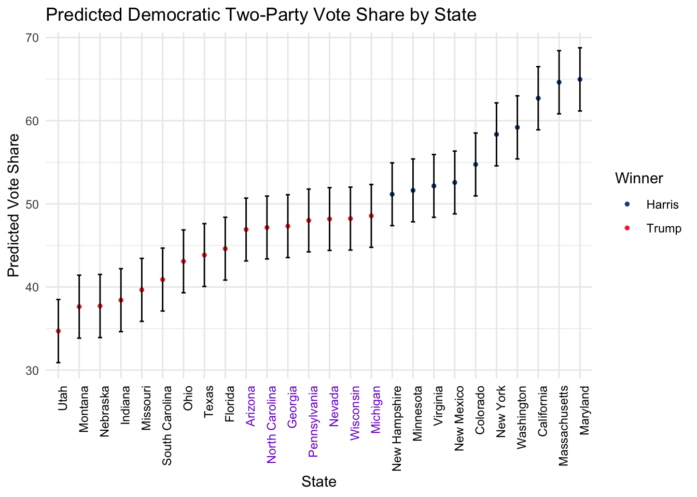
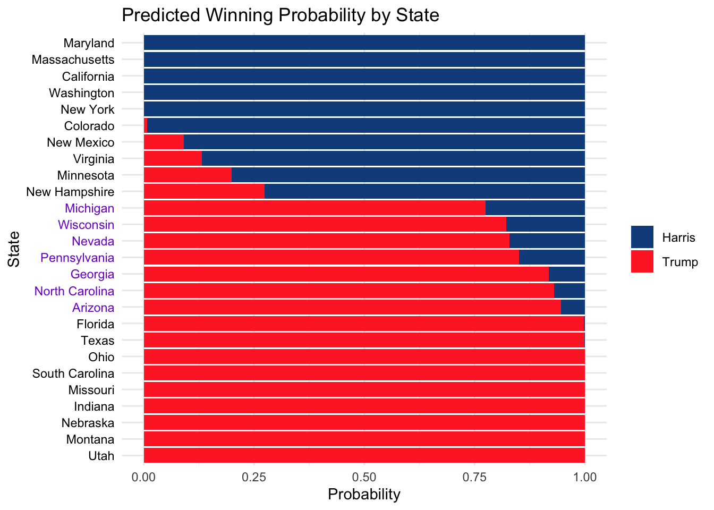
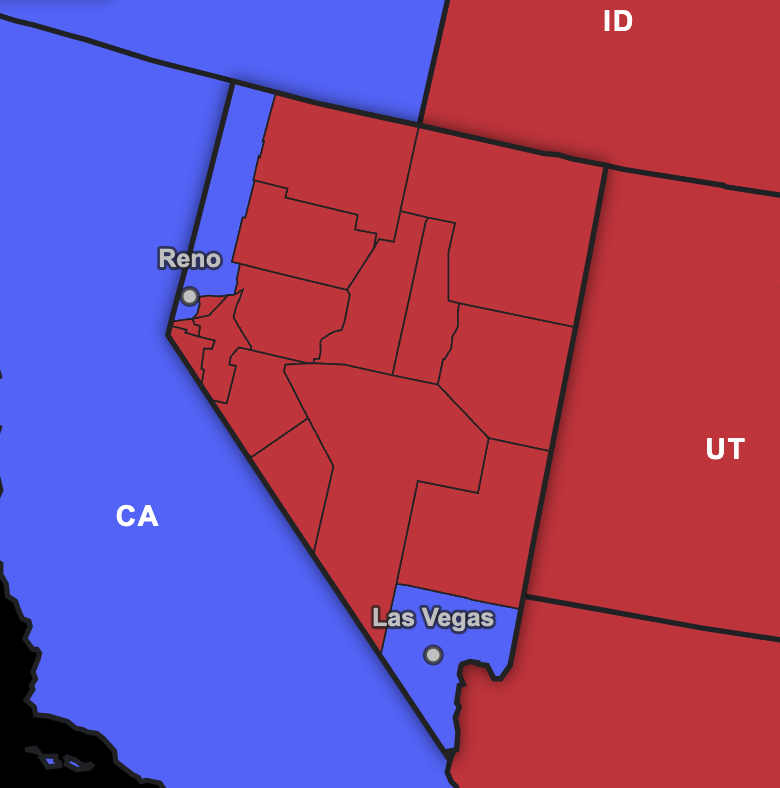
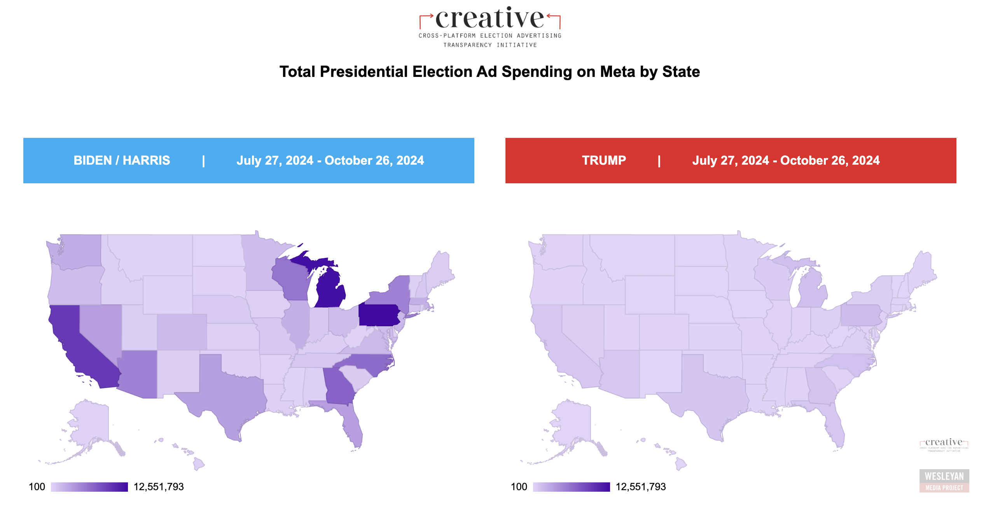

```{r setup, include=FALSE}
knitr::opts_chunk$set(echo = FALSE, warning = FALSE, message=FALSE)
set.seed(123)

library(dplyr)
library(ranger)
library(ggplot2)
library(ggrepel)
library(tidyverse)
```

# Overview of Nevada

Nevada is a landlocked state in the western region of the United States with a population of 3.1 million as of 2024. The state is highlighted below.

```{r}
# Install and load the necessary packages
library(ggplot2)
library(maps)

# Get US state map data
states <- map_data("state")

# Plot the map and highlight Nevada
ggplot(data = states, aes(x = long, y = lat, group = group)) +
  geom_polygon(fill = "gray", color = "white") +
  geom_polygon(data = subset(states, region == "nevada"), fill = "orange") +
  theme_minimal() +
  labs(title = "The State of Nevada")
```

Nevada is a sparsely populated state. She ranks 42nd by population density. [@bureau_population_nodate]
Nevada has 17 counties, but roughly a third of her people lives in Clark County, which contains the city of Las Vegas. This makes her a state whose population is largely centralized.

```{r}
# install.packages("tigris")
# install.packages("ggplot2")
# install.packages("sf")
library(tigris)
library(ggplot2)
library(sf)

# Load Nevada counties data
nevada_counties <- counties(state = "NV", cb = TRUE)

# Coordinates for Las Vegas
las_vegas <- data.frame(
  city = "Las Vegas",
  lon = -115.1398,
  lat = 36.1699
)

# Plot Nevada counties and highlight Las Vegas
ggplot() +
  geom_sf(data = nevada_counties, fill = "lightblue", color = "black") +
  geom_point(data = las_vegas, aes(x = lon, y = lat), color = "red", size = 3) +
  geom_text(data = las_vegas, aes(x = lon, y = lat, label = city), nudge_y = 0.2, size = 4, color = "red") +
  theme_minimal() +
  labs(
    title = "Nevada's 17 Counties with Las Vegas Highlighted",
    subtitle = "Las Vegas marked in red",
    x = "Longitude",
    y = "Latitude"
  )
```

Nevada has an average income level. The median household income is $60,365 in 2020 and she ranks as the 24th state by median household income. [@bureau_income_nodate]

Nevada's modern population is driven by immigration. Around 75\% of Nevadans are not born in Nevada. [@aisch_where_2014]

The graphic below shows the breakdown of Nevada by race/ethnicity. [@noauthor_p2_nodate] Nevada is the third most diverse state after Hawaii and California. [@rodgers_census_2021]

```{r}
# Data for population 2020
categories <- c(
  "White alone (NH)",
  "Black or African American alone (NH)",
  "Native American or Alaska Native alone (NH)",
  "Asian alone (NH)",
  "Pacific Islander alone (NH)",
  "Some Other Race alone (NH)",
  "Mixed Race/Multi-Racial (NH)",
  "Hispanic or Latino (any race)"
)
pop_2020 <- c(
  1425952,
  291960,
  23392,
  265991,
  22970,
  17171,
  166921,
  890257
)

# Calculate percentages
pop_2020_percent <- pop_2020 / sum(pop_2020) * 100

# Create a data frame
data <- data.frame(
  Category = categories,
  Population = pop_2020_percent
)

df1 <- data |>
  arrange(Population)

# Add a single x-axis category to stack everything
df1$State <- "Nevada"

# Reorder the Category variable by descending Population
df1$Category <- reorder(df1$Category, df1$Population)

# Plot the stacked bar chart
ggplot(df1, aes(x = State, y = Population, fill = Category)) +
  geom_bar(stat = "identity") +
  labs(
    title = "Population of Nevada by Race/Ethnicity in 2020",
    x = "",
    y = "Population (%)",
    fill = "Race/Ethnicity"
  ) +
  theme_minimal() +
  theme(axis.text.x = element_blank(), axis.ticks.x = element_blank())
```


A characteristic of Nevada is its libertarian laws. Nevada has legalized gambling and prostitution, with lenient marriage laws. Tourism is a big driver of her economy followed by mining.


Looking at the 2020 voting results, Nevada borders the Democratic stronghold states of California and Oregon to her west and northwest, and borders the Republican stronghold states of Idaho and Utah to her northeast and east. Nevada also shares a border with swing state Arizona to her southeast.

```{r}
# another way to get the state results (by scraping)
truth2024 <- read.csv("../data/results.csv")
truth2024 <- truth2024 |>
  mutate(inc_pv2p = harris_votes/(trump_votes+harris_votes)*100) |>
  select(state,inc_pv2p)

# combine all data including 2024
# and rename them
data2024 <- read.csv("../data/data2024.csv")
data2024$year <- 2024
data2024$X <- NULL
data2024$preds <- NULL
data2024 <- data2024 |>
  left_join(truth2024,by="state")

state_popvote_gdp_polls <- read.csv("../data/state_popvote_gdp_polls.csv")

all_data <- state_popvote_gdp_polls |>
  select(colnames(data2024))

all_data <- rbind(all_data, data2024)
```


```{r}
# Get US state map data
states <- map_data("state")

# Define the states and their political leanings
state_parties <- data.frame(
  region = c("nevada", "california", "oregon", "utah", "idaho", "arizona"),
  party = c("Swing State", "Democratic", "Democratic", "Republican", "Republican", "Swing State")
)

# Join the state map data with the political data
states_with_party <- left_join(states, state_parties, by = "region")

# Plot the map and highlight states by party
ggplot(data = states, aes(x = long, y = lat, group = group)) +
  geom_polygon(data = states_with_party, aes(fill = party), color = "white") +
  scale_fill_manual(
    values = c(
      "Swing State" = "purple",
      "Democratic" = "dodgerblue4",
      "Republican" = "firebrick1"
    ),
    na.value = "gray"
  ) +
  theme_minimal() +
  labs(
    title = "The Political Leanings of the Neighbors of Nevada",
    fill = "Party"
  )
```

Nevada herself voted Democratic for the past four elections, but the margin has been narrowing across the years.

```{r}
nevada_results <- state_popvote_gdp_polls |>
  filter(state == "Nevada") |>
  select(c(year, D_pv2p))

nevada_results$year <- as.factor(nevada_results$year)

ggplot(nevada_results, aes(x = year, y = D_pv2p-50)) +
  geom_bar(stat = "identity", aes(fill = ifelse(D_pv2p > 50, "dodgerblue4", "firebrick1"))) +
  scale_fill_identity() +
  geom_hline(yintercept = 0, linetype = "dashed") +
  labs(x = "Year", y = "Democratic two-party margin (%)", title = "Nevada Recent Presidential Election Results") +
  coord_cartesian(y=c(-10,10))+
  theme_minimal()
```

Aside from the U.S. president, the Senate and House elections were also held. There were 2 positions for the Senate and 4 positions for the House.

# Forecasts

[Sabato](https://centerforpolitics.org/crystalball/2024-president/) gave Nevada a "Lean Democrat", while [Cook](https://www.cookpolitical.com/ratings/presidential-race-ratings) considered it a "Toss Up". In [538](https://projects.fivethirtyeight.com/2024-election-forecast/)'s simulations, Harris won 50 times out of 100. In my forecast, I predicted that Harris will win 48.17\% of the two-party vote, with a 95\% prediction interval of (44.40\%, 51.95\%).



I gave Harris a probability of winning Nevada of 17.52\%.

```{r}
state_odds <- read.csv("../data/state_odds.csv")
# View(state_odds)
```



The actual election results show Trump winning 751,205 votes and Harris 705,197. This gives Trump a two-party vote share of 51.58\% and Harris 48.42\%. The Harris vote share is within 0.25\% of our prediction, and we have very slightly underestimated Harris. We conclude that Nevada's results are within our expectations.


The expert ratings are correct to call it a close race, defying only Sabato's lean Democrat rating.

# Campaign

First we compare the campaign spending of both parties in Nevada. One way of measuring this is looking at the ad spend on Meta (otherwise known as Facebook). Data from [the Wesleyan Media Project](https://geo-ad-spending-813751399605.us-central1.run.app/) shows that Democrats outspent Republicans by a huge margin, at least on Meta.

```{r}
# Create a data frame for the spending data
campaign_spending <- data.frame(
  Candidate = c("Harris", "Trump"),
  Spending = c(3307670, 558133)
)

# Load ggplot2 for visualization
library(ggplot2)

# Create the horizontal stacked bar chart
ggplot(campaign_spending, aes(x = Spending, y = Candidate, fill = Candidate)) +
  geom_bar(stat = "identity", position = "stack") +
  labs(
    title = "Campaign Spending on Meta Comparison in Nevada",
    x = "Spending (in USD)",
    y = ""
  ) +
  scale_x_continuous(labels = scales::dollar_format()) +
  theme_minimal() +
  scale_fill_manual(values = c("dodgerblue4", "firebrick1")) +
  theme(legend.position = "none")  # Hide legend as it is clear
```

Here is a graphic that compares the amount of ad spending across all states. Even though Democrats outspent the Republicans, it appears that the Harris campaign did not focus as much funds on Nevada in comparison to Michigan or Pennsylvania, presumably due to strategic spending as the 6 votes from Nevada are not substantial to get past the post.



We now look into TV ad airings ([source](https://mediaproject.wesleyan.edu/issues-sept24/)). Nevada for its small population received much TV ad airings, with on average 6 ads per 1000 person in comparison to the national average of less than 2 ads per 1000 person.

```{r}
# Create a data frame for the spending data
# Original dataframe
data <- data.frame(
  Category = c("TV_Ad_Airings", "Abortion", "Guns", "Healthcare", "Housing", 
               "Immigration", "Inflation", "Public_Safety", "Energy_Environment"),
  Total_US = c(598176, 24, 16, 3, 29, 8, 26, 16, 22),
  Pro_GOP_US = c(237100, 4, 24, 1, 21, 7, 43, 31, 33),
  Pro_Dem_US = c(354653, 37, 12, 4, 35, 8, 16, 6, 15),
  Nevada = c(18487, 24, 13, 0, 33, 31, 7, 12, 4)
)

row <- data[1,]

df2 <- t(row)
df2 <- df2[2:nrow(df2),1]

v <- data.frame(
  x = as.numeric(df2),
  y = names(df2)
)

v[c(T,T,T,F),]$x <- v[c(T,T,T,F),]$x / 334.9e6 * 1e3
v[c(F,F,F,T),]$x <- v[c(F,F,F,T),]$x / 3.1e6 * 1e3

# Create the horizontal stacked bar chart
ggplot(v, aes(x = x, y = y, fill = y)) +
  geom_bar(stat = "identity", position = "stack") +
  labs(
    x = "Number of ad airings per 1000 people in September 2024",
    y = ""
  ) +
  theme_minimal() +
  theme(legend.position = "none")  # Hide legend as it is clear
```

As to the topic of ads, most ads in Nevada talk about housing (33\%), followed by immigration (31\%). Notably, ads from both parties frequently mentioned housing, with 35\% of Democrat ads (second highest after abortion) and 21\% of Republican ads. Note that housing is also the most frequent topic across all states (29\%). The Republicans are seen to play an insurgent role, with many of their ads mentioning inflation (43\%).

```{r}
# Reshape the data to long format for easier plotting
library(reshape2)


data$Category <- reorder(data$Category, data$Nevada)

data <- data |> filter(Category != "TV_Ad_Airings")

# Convert data to long format
data_long <- melt(data, id.vars = "Category", 
                  variable.name = "Group", value.name = "Value")

# Create the grouped bar chart
ggplot(data_long, aes(x = Category, y = Value, fill = Group)) +
  geom_bar(stat = "identity", position = position_dodge()) +
  labs(
    title = "Percentage of ads that mentions a topic in September 2024",
    x = "Topic",
    y = "Percentage of ads that mentions the topic"
  ) +
  scale_fill_manual(values = c("dodgerblue4", "firebrick1", "forestgreen", "gold")) +
  theme_minimal() +
  theme(axis.text.x = element_text(angle = 45, hjust = 1))
```
 
 To further analyze the campaign narrative, I have scrapped all 400+ articles from [The Nevada Independent](https://thenevadaindependent.com/) that have the tag "Election 2024" on them. I then pass this through a large-language model (Anthropic's [Claude 3.5 Sonnet](https://www.anthropic.com/news/claude-3-5-sonnet)) to classify who will be most satisfied with the article: Democrat, Republican or Neutral. We also classified the news articles by how Vavreck classified candidate speeches [@noauthor_message_2009] to see what are the topics of the news associated with each party.
 
```{r}
# ni for nevada independent
ni <- read.csv("../data/claude_results_cleaned.csv") |>
  select(c("text","response","category"))
```

```{r}
ggplot(data = ni, aes(x = response, fill = response)) +
  geom_bar(color = "black") +
  scale_fill_manual(values = c("Republican" = "firebrick1", 
                               "Democrat" = "dodgerblue4", 
                               "Neutral" = "gray")) +
  labs(title = "Number of news articles tagged Election 2024 where a party will be happy to see",
       x = "Party",
       y = "Count") +
  theme_minimal()
```

The Nevada Independent has more articles that will please a Democrat than a Republican, but most of the articles are neutral.

As expected of a local newspaper, most articles tagged as 2024 Election falls under the Domestic Policy category, followed by Traits. Economy was featured in some of the articles, with Foreign Policy and Defense taking a back seat.

```{r}
ggplot(data = ni, aes(x = category, fill = category)) +
  geom_bar(color = "black") +
  labs(title = "Number of news articles tagged as 2024 Election by topic",
       x = "Party",
       y = "Count") +
  theme_minimal()
```

We now classify each article in each party by topic, to see if the Republicans or the Democrats campaigns are projecting on different issues.

```{r}
ggplot(data = ni, aes(x = response, fill = category)) +
  geom_bar(position = "fill", color = "black") +
  labs(title = "Proportion of topics in news articles preferred by each party",
       x = "Party",
       y = "Proportion",
       fill = "Category") +
  theme_minimal()
```
 
It turns out that the Republicans focused more on traits and economy. This shows that the Trump campaign is running an insurgent campaign treating the perception of the economy as bad, and offering voters a chance to change into a new administration. Note that as in a previous graphic above, we showed that the Trump campaign aired mostly inflation ads.

# A Possible Explanation of the Democrat Defeat

Although we have predicted that the odds are stacked against the Democrats at 82\% to 18\%, it could have been possible that Democrats would have won if they applied an optimal campaign strategy. However, with the odds in their favor, the Trump campaign has successfully applied an insurgent campaign to focus on the economy and sealed any chances of a Democrat win. The Democrat defeat in Nevada and elsewhere is a product of the local perception of a bad economy and the successful focus of the Trump campaign on the economy. Biden pulled out of the race in June when it was clear that the odds are against the incumbent party due to the economy. Harris was given a very tough chance but that chance was blown when her campaign did not focus on clariyfing and distancing their responsibility from the economy. This election can serve as an example for Vavreck's theory on how to run a successful insurgent campaign against an incumbent that failed to clarify.

# References
